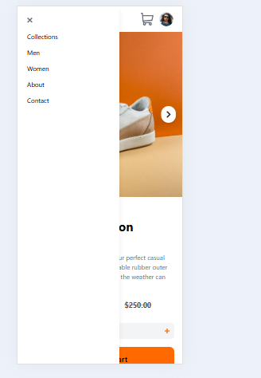
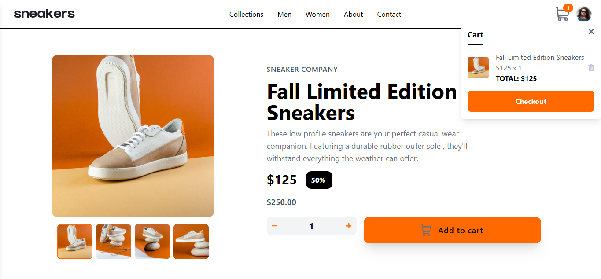

# Frontend Mentor - E-commerce product page solution

This is a solution to the [E-commerce product page challenge on Frontend Mentor](https://www.frontendmentor.io/challenges/ecommerce-product-page-UPsZ9MJp6). Frontend Mentor challenges help you improve your coding skills by building realistic projects.

## Overview 
This is a front-end mentor challenge that reqiures me to buils an e-commerce product page with a lightbox gallry snad add to cart / remove from cart functionalities. 
Users can:

- View the optimal layout for the site depending on their device's screen size
- See hover states for all interactive elements on the page
- Open a lightbox gallery by clicking on the large product image
- Switch the large product image by clicking on the small thumbnail images
- Add items to the cart
- View the cart and remove items from it

## Technology and Stack
React Javascript: The core Javascript library for building web applications.
Tailwindcss: The CSS framework used in the development of this project is Tailwindcss. 

## Challenges Encountered 
- Getting the cart badge to show 
- Setting up a local strorage to store the user's cart info unless deleted by the user.

## Screenshots 
- Mobile view.
    -  
    -  
- Desktop View.
    -  

## What I Learned 
I learnt quite a lot, I got better with state managements most especially and conditional display of elements. I look forward to applying this knowledge in another project. I am grateful to Frontend Mentor for this kind of opportunity to learn a real-word project. 

## Author 
Chioma Ineh.

